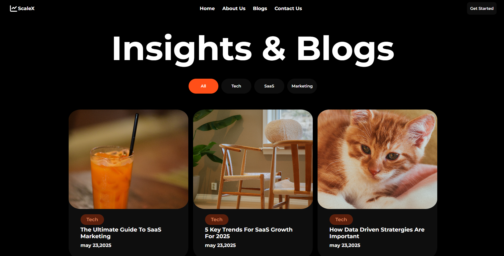

# ScaleX Blogs Page

A modern and responsive blog landing page built using **HTML5** and **CSS3** as part of **Assignment #2 of Cohort 2.0**.

## 🚀 Live Demo

🔗 Add your GitHub Pages link here

## 📸 Preview



## 🛠️ Tech Stack

- HTML5
- CSS3
- Flexbox
- Responsive Design

## ✨ Features

- Modern dark-themed UI
- Responsive navigation bar
- Blog category filter section
- Blog card layout
- Clean typography and spacing
- Fully responsive design
- Pixel-perfect implementation

## 📂 Project Structure

```text
assignment-2-scalex-blog-page/
├── index.html
├── style.css
├── assets/
├── preview.png
└── README.md
```

## 📚 Assignment Details

This project was built as **Assignment #2 of Cohort 2.0**, focusing on recreating a modern blog landing page using only HTML and CSS while improving layout, spacing, responsiveness, and UI design skills.

## 🎯 Learning Outcomes

- Building responsive layouts
- Working with Flexbox
- Designing modern card components
- Creating navigation bars
- Improving UI/UX fundamentals
- Structuring scalable frontend projects

## 👨‍💻 Author

**Bhavesh Bhoi**

GitHub: https://github.com/bhaveshbhoi256

---

⭐ Feel free to explore the project and share your feedback.
